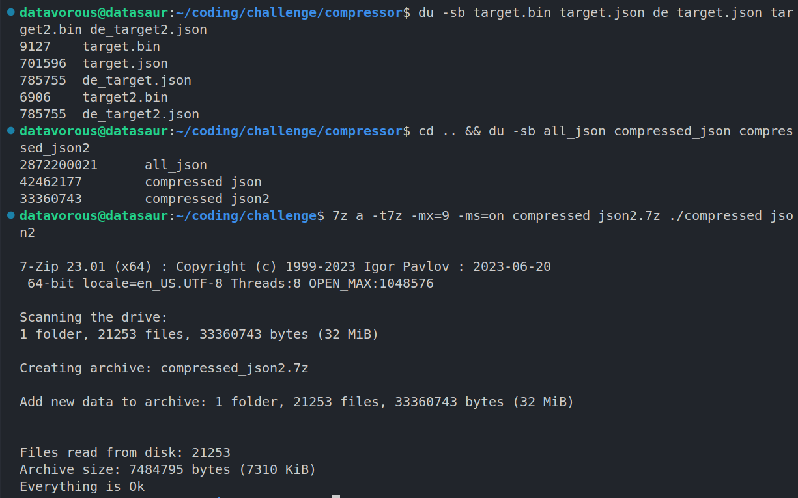

# Challenges

## Custom Data Compressor*

Inspired by [Reddit :: How I was able to fit 1.2GB of cricket data into 50MB](https://www.reddit.com/r/developersIndia/comments/1hu0w88/how_i_was_able_to_fit_12gb_of_cricket_data_into/)

Original Folder Size: 2,872,200,021 bytes (~2.87 GB)  
Custom v1: 42,462,177 bytes (~42.46 MB)  
Custom v2 (bowler-per-over): 33,360,743 bytes (~33.36 MB) [21% smaller than v1]  
   
gzip: 52,980,912 bytes (~52.98 MB) (`tar -cf - all_json | gzip -9`)  
7z(LZMA): 45,026,348 bytes (~45.02 MB) (`7z a -t7z -mx=9 -ms=on`)  

Custom + 7z(LZMA): 8.9MB  
Custom v2 + 7z(LZMA): 7,484,795 bytes (~7.3 MB) (!)

Read the [writeup](compressor/README.md).

[Download](https://drive.google.com/file/d/1hsmN-ljxVwv1mNC9m7Jp8tg1bRFGb-PO/view?usp=sharing) the compressed JSON files.

The goal is to compress a cricket match dataset (Cricsheet JSON format) into the smallest possible representation. 

Standard compression finds patterns in text statistically. This instead exploits the predictable schema of the files and encodes cricket rules directly as structural invariants in the binary layout which makes illegal states unrepresentable.

For example: cricket law guarantees one bowler per over, so the bowler ID is stored once in the over header rather than on every delivery, eliminating the redundancy entirely rather than compressing it.

> [!NOTE]
> This is not a compressor in the traditional sense but a **schema-driven binary codec** that encodes domain invariants structurally. Where LZMA finds redundancy statistically, this format eliminates it by asserting preconditions.

Rooted in [Shannon's source coding theorem](https://en.wikipedia.org/wiki/Shannon%27s_source_coding_theorem): a symbol whose value is guaranteed by a domain rule has entropy 0 and should cost 0 bits to store.