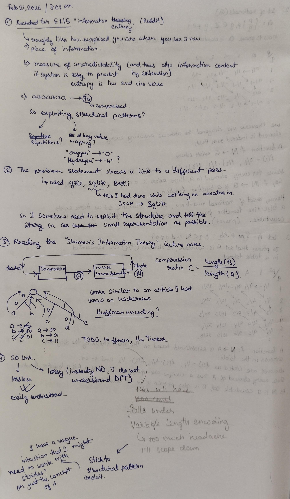
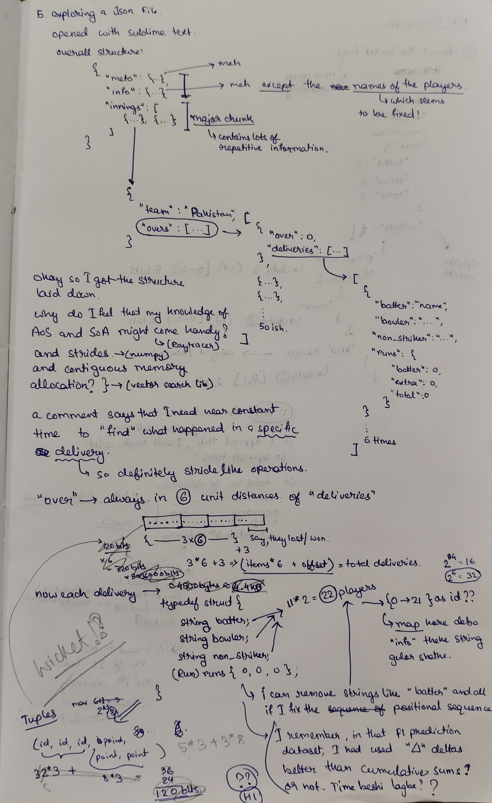
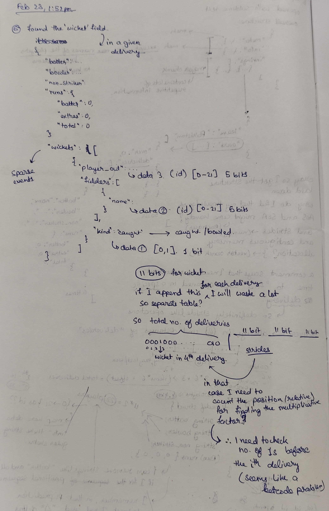

# Reasoning

### [METADATA]

The file begins by storing metadata at the top. The objective is to use the "players" names to create a lookup index. Since there are a total of 22 players, each name is mapped to an ID from 0 to 21.

### [DELIVERIES]

Most deliveries follow a standard pattern. 

For the batter, bowler, and non striker, the maximum ID is 21, so 5 bits are allocated for each since 2^5 = 32. For runs, the maximum is usually 6, so 3 bits. One additional bit is used as a flag to signal a wicket. 

This creates a stride length of 24 bits per delivery. To access any specific delivery information, a simple calculation of `n * stride_length + offset` is enough.

### [WICKETS]

Using a bitmask here where the total number of bits equals the total number of deliveries.

Something like 00010 would indicate that the 4th delivery resulted in a wicket.

To access total wicket info, the system checks the ith bit in that data and calculates the number of 1s appearing before it. 

This count is then used as a second index to look up a separate wicket info table.

This separate table uses 5 bits for the player out, 5 bits for the fielder, and 1 bit for bowled/caught. By using this second index, the required wicket information can be accessed directly then.

JSON File Structure:

```json
{
  "info": {
    "teams": ["Team A", "Team B"],
    "players": {
      "Team A": ["Player 1", "Player 2", "..."],
      "Team B": ["Player 3", "Player 4", "..."]
    }
  },
  "innings": [
    {
      "team": "Team A",
      "overs": [
        {
          "over": 0,
          "deliveries": [
            {
              "batter": "Player 1",
              "bowler": "Player 3",
              "non_striker": "Player 2",
              "runs": { "batter": 4, "extras": 0 },
              "wickets": [  // optional field
                {
                  "player_out": "Player 1",
                  "kind": "caught",
                  "fielders": [{ "name": "Player 4" }]
                }
              ]
            }
          ]
        }
      ]
    }
  ]
}
```
## Brainstorming



